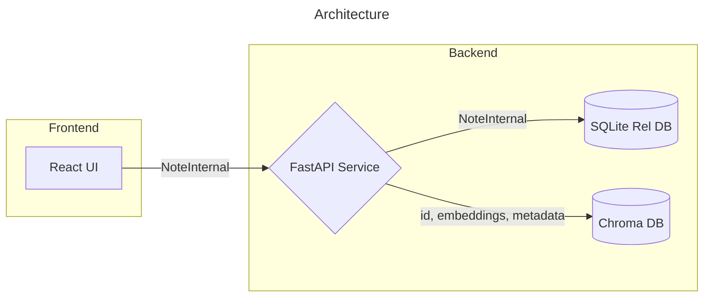
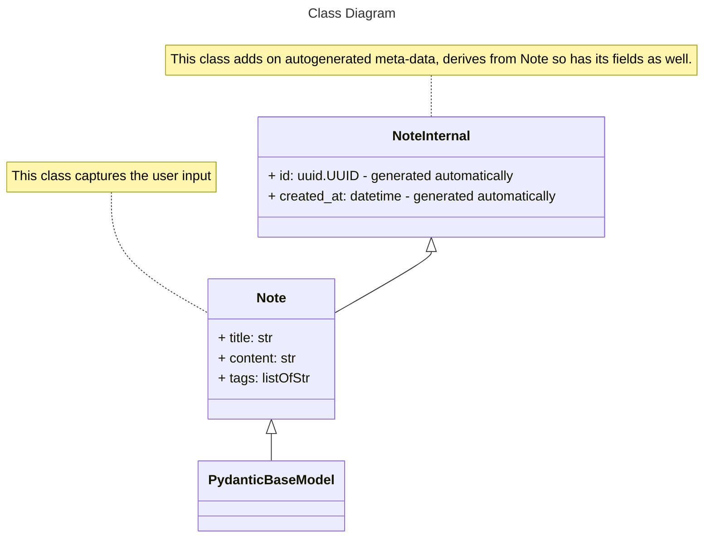
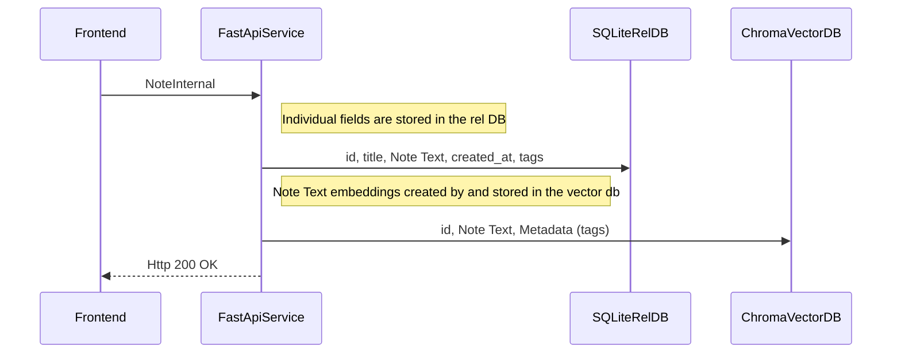
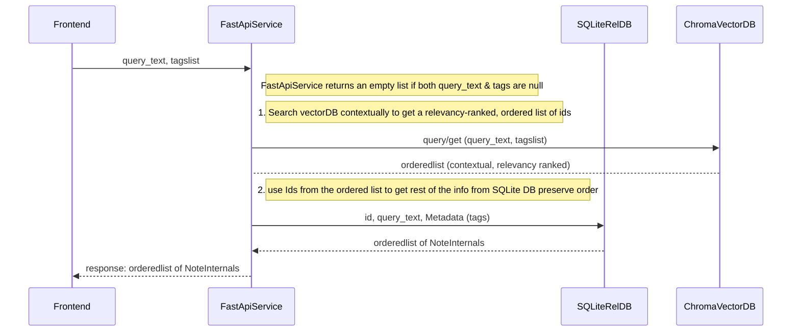

# MemoryOS (version 1)

Healthcare organization handle internal tickets in a reactionary fashion. There is no organizational memory to identify patterns, analyze trends etc. So I used the Agent architecture from MedTicketOptimizer and built an archival system around it. 

This is the first version or persistent memory storage, contextual search and retrieval. 

# Operation

Memory OS allows one to insert tickets individually or upload some sample tickets as a batch. The user can then search for data using contextual search. Eg. For "Bad medication" will fetch tickets containing text such as 'incorrect dosage', 'wrong medication' etc. 

The user has an option to enter a list of tags. Tag search is case senstive and strictly lexical for this version. Multiple tags should be separated by commas and results will be filtered such that only the notes containing any of the tags mentioned are returned. 

Results are ordered: closest to the query text and containing one or more of the tags are returned first. 

## Class Architecture
### Tech Stack
- Python
- FastAPI
- React + Vite
- OpenAI Responses API
- Structured Outputs / JSON Schema
- Pydantic
- Bootstrap
- SQLite (relational database)
- ChromaDB (vector database)

We are using a hybrid database architecture for storage as it easily enables us to easily iterate on embeddings based on the application: eg change the embedding function, use external APIs or use an entirely different Vector database. 

- SQLite - This is the primary "source of truth" if we need to change the Vector database.
- ChromaDB - this is our vector database. We are using its default embedding function but we can change it to an external embedding API (eg OpenAI) for minimal memory footprint deployments. 


## Class Diagram




## Note Insertion Operation



## Contextual search and retrieval 

We use the ChromaDB SDK to perform Contextual search. This operation converts the query text into vector embeddings then uses nearest neighbor results to retrieve contextually similar results from the database. 

We can also search with note metadata (in our case a list of strings). Metadata search is strictly keyword based and is case sensitive. During usage, separate the metadata to be searched for using commas and they have to be strictly case sensitive. Ordered results containing any of the tags will be returned. 



## How to run it
- Download the git repository

    ```git clone https://github.com/saclearn75/MedTicketOptimizerMemoryOS.git```

- create an API Key for the OpenAI SDK -

    * Website - https://platform.openai.com/api-keys; Create an account and a secret key.
    * create a file called .env in the <locally-cloned-repo>\backend folder
    * Add the line OPENAI_KEY=<The-key-you-just-created> and save and close the file (so you dont accidentally edit it)

- Backend 

    * create a python and start virtual environment* in the backend folder, run python -m venv venv
    * run ```.\venv\Scripts\activate``` to start the virtual environment
    * download the backend dependencies - run pip install -r requirements.txt
    * start the backend run uvicorn main:app --reload

- Frontend

    * navigate to <locally-cloned-repo>\frontend folder on the command prompt CLI.
    * run npm install. This reads the package.json file, downloads dependencies and creates the node_modules folder.
    * run npm start or npm run dev to start the vite server. The server will be listening, usually, at http:\\localhost:5173
    * open the http:\\localhost:5173 in your browser